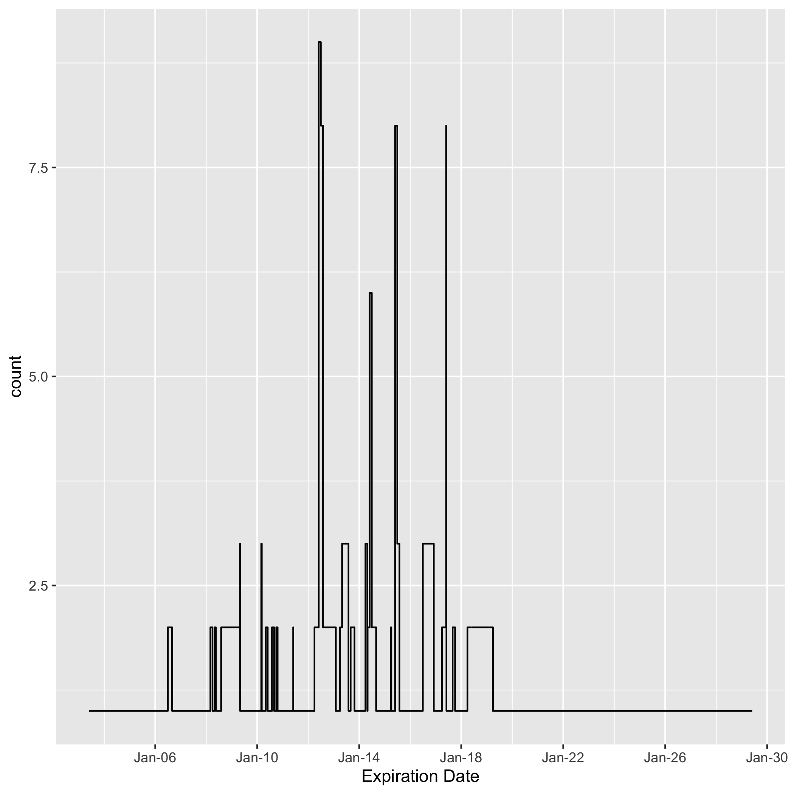
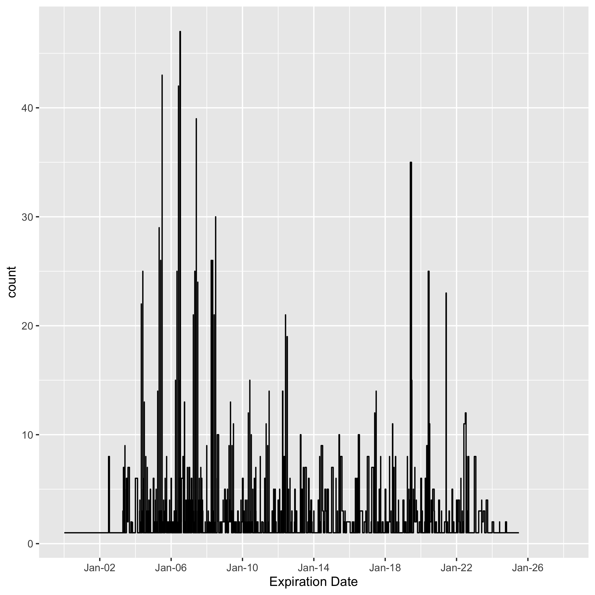

```{r setup, include=TRUE, warning=FALSE}
knitr::opts_chunk$set(echo = TRUE)

library(knitr)
library(tidytext)
library(tidyverse)
library(quanteda)
library(quanteda.textplots)
library(cowplot)
library(lubridate)
library(blscrapeR)
library(ggridges)
library(kableExtra)
```

```{r read-in}
# Read in data created in last post
clean_contracts_table <- read_csv(
  "/Users/dananestor/DACSS/Blog/Untitled/docs/_posts/2022-03-06-text-as-data-post-3/clean_contracts_table.csv",
  show_col_types = FALSE)
contract_frame <- read_csv(
  "/Users/dananestor/DACSS/Blog/Untitled/docs/_posts/2022-03-06-text-as-data-post-3/contract_frame.csv",
  show_col_types = FALSE) %>%
  group_by(Employer.Name)
```

### Data Exploration

Now that our files are sorted, text is extracted, and meta-data is gathered, we can proceed to explore the characteristics of the information that we seek to analyze. In this post, we will examine the key players in our inquiry - employers and unions - to understand how they are represented in our data. We will then walk through the creation of a corpus and pre-processing of text necessary to move on to modelling and further study.

#### Employers and Unions

One major assumption in the methodology discussed in [Post 2A](https://dnestor.github.io/posts/2022-02-27-text-as-data-post-2a/) is a sufficient number of employers with contracts before and after our key case to provide a statistically significant sample - too few, and it is likely that the data will lack the subtlety necessary to detect the semantic changes at issue. We can investigate the effects that cleaning our data and imposing this methodology have had on sample size by examining the original data obtained from OLMS and our subset consisting of employers with more than two machine-readable contracts.

```{r stats}
# Create table to show number of employers and unions
stats_table <- tibble( 
  "Rows" = c(
    "Number of Employers", 
    "Number of Unions"), 
  "Subset" = c(
    n_distinct(contract_frame$Employer.Name), 
    n_distinct(contract_frame$Union)), 
  "Original" = c(
    n_distinct(clean_contracts_table$Employer.Name), 
    n_distinct(clean_contracts_table$Union))) %>%
  column_to_rownames("Rows")

kable(stats_table, 
      caption = 'Employers and Unions Across Data Sorting') %>% 
  kable_styling(bootstrap_options = c("striped", "hover"), 
                full_width = FALSE)
```

A quick check of the number of unique employers in the original data set vs. the subset shows a reduction from `r stats_table[1,2]` to `r stats_table[1,1]`, which is a `r round(((stats_table[1,2] - stats_table[1,1])/stats_table[1,2]) * 100)`% decrease. Unions show a similar drop off, though slightly lower at a reduction of `r round(((stats_table[2,2] - stats_table[2,1])/stats_table[2,2]) * 100)`%.

While this is a concerning reduction, we need more information to determine the best course of action. Even a small number of employers can allow for a result as long as each has a sufficient number of contracts to detect changes in our measurements. Next, we pull out the top employers and unions as ranked by the number of contracts in our subset to see if this may be the case.

```{r top-emp}
# Lists of top 10 employers and unions in subset
top_employers <- contract_frame %>% 
  summarise(n = n()) %>% 
  arrange(desc(n)) %>%
  slice_head(n = 10)

kable(top_employers, 
      caption = 'Top 10 Employers in Subset') %>% 
  kable_styling(bootstrap_options = c("striped", "hover"))
```

While not ideal, we can see that there are eight employers with four or more contracts in the subset, meaning that they could have two before and after the key case.

```{r top-unions}
top_unions <- contract_frame %>% 
  ungroup() %>%
  group_by(Union) %>%
  summarise(n = n()) %>% 
  arrange(desc(n)) %>%
  slice_head(n = 10)

top_unions$Union <- str_trunc(top_unions$Union, 40)

kable(top_unions, 
      caption = 'Top 10 Unions in Subset') %>% 
  kable_styling(bootstrap_options = c("striped", "hover", "responsive"), 
                full_width = FALSE)
```

Unions in the subset offer fewer overall individuals with four or more contracts, but two of them have 10 or more which could be useful for a very specific dive into changes over time.

One notable finding when examining the top employers and unions is the lack of consistency in naming conventions. For example, the trade association AGC appears multiple times in the top 10 entries of employers, with each instance representing a chapter in a different region. Similarly, in the union data, we see different entries for local chapters of different unions, such as the International Union of Operating Engineers. However, it is unclear whether this is a positive or negative characteristic.

On the one hand, combining regional entities into one organization may allow for higher sensitivity in detecting topics given the small sample size if the assumption is made that strategy related to federal labor law will be coordinated centrally. Alternately, this may make it more difficult to detect (and possibly control for) regional variations in contracts motivated by state-level labor law. We must take this into account when modelling and developing an iterative analysis to critically understand how the judicial environment might influence labor contracts.

#### Expiration Date Distribution

To pick a court case that would allow for the analysis proposed in this project, we can look at the distribution of expiration dates to see at minimum what range we should consider. Hopefully we will find a multi-modal distribution that would clearly indicate the farthest back to look, given the assumption that contracts expiring before a case will not be influenced by it.

Note that this rests on a somewhat weak assumption that contracts expiring after the case we pick will have been drafted after the case was decided. This is obviously not guaranteed. However, because we do not have meta-data available on the effective date of the contract, we will have to use this variable as our best approximation. This is an area for methodological improvement in the future.

We'll start by plotting the number of contracts expiring per-year in our subset to see if any patterns emerge.

```{r dates-subset, eval=FALSE}
# Format dates as M/D/Y
clean_contracts_table$Expiration.Date <- mdy(clean_contracts_table$Expiration.Date) 
contract_frame$Expiration.Date <- mdy(contract_frame$Expiration.Date)

# Expiration date distro plots
options(scipen = 999) #suppress scientific notation

date_subset <- ggplot( #plot count by date in subset
  subset(contract_frame, 
         !is.na(Expiration.Date)), 
  aes(Expiration.Date)) +
  geom_step(stat = "count") +
  scale_x_date(
    name = "Expiration Date", 
    date_labels = "%b-%y", 
    date_breaks = "4 year")

ggsave("date_subset.png", date_subset)
```



Examining this chart, we can see that there appear to be spikes around 2012, 2014, 2015, and 2017. It also shows a number of contracts expiring before 2012, and that our data is limited when it comes to contracts expiring after 2018. Given this information, we may want to search for a case decided in 2011 or 2012 to ensure that we have enough data points on either side.

This plot also leads us to wonder if our original data set would offer a more informative distribution (thus supporting the work to further OCR documents). To check, we create the same plot but with our original data.

```{r dates-original, eval=FALSE}
date_original <- ggplot( #plot count by date in original
  subset(clean_contracts_table, 
         !is.na(Expiration.Date)), 
  aes(Expiration.Date)) +
  geom_step(stat = "count") +
  scale_x_date(
    name = "Expiration Date", 
    date_labels = "%b-%y", 
    date_breaks = "4 year", 
    limit = c(as.Date("2000-01-01"), #reduce x-axis for interpretability
              as.Date("2028-01-01"))) 

ggsave("date_original.png", date_original)
```



Here we see a very different distribution - unsurprisingly, there are many more observations in each peak. But the range has also expanded to include many more contemporary documents. Moreover, we can see that the largest peak on the subset graph - occurring in 2012 - is quite a bit smaller than the largest peaks in our original data. And, as we had initially hoped, this distribution appears bi-modal, showing a large proportion of contracts expiring before 2010 and after 2018, which could provide a very interesting gap to investigate for a court case.

Taken together, the evidence mounts for increasing our sample size. However, in the absence of time, we are at least on somewhat stable ground in looking for cases around 2011 or 2012.

This data only shows us a distribution relative to the entire corpus, however, and since we are proposing an analysis across employers to try and control for covariance, we need to tie our visualizations to employers specifically. This way, we can see where each employer falls in terms of when their contracts represented in our corpus expire. Again, ideally this would show a multi-modal distribution for at least a few employers so we can be sure that our analysis will incorporate data representative of our research question.

To proceed, we graph the distribution of expiration dates within our subset, but grouped by employer.

```{r dates-group, eval=FALSE}
date_grouped_subset <- ggplot( # plot distro by employer
  contract_frame, 
  aes(x = Expiration.Date, 
      y = Employer.Name, 
      fill = Employer.Name)) +
  stat_binline(bins = 28, scale = 0.8, draw_baseline = F) +
  theme_ridges() + 
  theme(legend.position = "none", 
        axis.text.y = element_blank()) +
  scale_x_date(
    name = "Expiration Date", 
    date_labels = "%b-%y", 
    date_breaks = "4 year")

ggsave("date_grouped_subset.png", date_grouped_subset)
```


This graph is less informative than we had hoped. While it does show spacing between contracts for each employer, it is difficult to visualize the density of contracts for each employer over time. While we tried to accomplish this with the geom_density_ridges function, it was not sensitive enough to pick up on the multimodality of the data.

However, we can glean from this chart that most employers do in fact have contracts that expired before and after 2012, further supporting picking a case from that timeframe.

#### Geographic Distribution

We can also look at the distribution of contracts by state and region to see any potential representation issues in our contracts. To do this, we clean up the location column and add in regions using a matching function and data from the census bureau; then plot.

```{r regions}
# Regions distro
contract_frame$Loc_unique <- contract_frame$Location %>% #clean up locations
  str_replace_all("OHIO", "OH") %>%
  str_replace_all("FORT HILL, OK", "OK") %>%
  str_replace_all("PASCAGONOULA, MISSISSIPPI", "MS") %>%
  str_replace_all("PASCAGOULA", "MS") %>%
  str_replace_all("U.S.", "NATIONAL")  %>%
  str_replace_all("(..).+", '\\1') %>%
  str_replace_all("NA", "NATIONAL")

regions <- as_tibble( #add region column using census data
  read_csv('/Users/dananestor/DACSS/Useful Data/us census bureau regions and divisions.csv')) %>%
  rbind(rep("NATIONAL", 4))
contract_frame$Region <- regions$Region[match(
                            contract_frame$Loc_unique, 
                            regions$`State Code`)] %>%
  str_replace_all("NATIONAL", "National")

states_subset <- contract_frame %>% #plot by state
  ungroup() %>%
  ggplot(aes(Loc_unique)) +
  geom_bar(stat = "count") +
  labs(
    title = "Distribution by State", 
    x = "State") +
  theme(
    axis.text.x = 
      element_text(angle = 45, hjust=1))

regions_subset <- contract_frame %>% #plot by region
  ungroup() %>%
  ggplot(aes(Region)) +
  geom_bar(stat = "count") +
  labs(
    title = "Distribution by Region", 
    x = "Region") +
  theme(
    axis.text.x = 
      element_text(angle = 45, 
                   hjust=1))

plot_grid(states_subset, 
          regions_subset, 
          rel_widths = c(2.25,.75))
```

In examining the results, we can see that Alaska, Indiana, and Missouri have much higher numbers of contracts relative to other states than their populations would suggest. Similarly, the regions plot shows that the Northeast seems to be underrepresented relative to the other regions. This should be taken into account in any analysis, and we may need to control for it as we continue data exploration.

#### Industry Distribution

Finally, we look at distribution across industry within our subset. One of the papers we are relying on for the formulation of this methodology - Ash, et. al. [@ash2019] - found significant results when comparing their findings across industries so it is important not only to have this information available, but to see how it is represented in our data.

We start by importing NAICS data from the census bureau, which will allow us to match against the NAICS meta-data already in our contracts file. We then match the two columns and pull in the full industry name, cleaning up along the way. However, this is more data than we need - it gives hundreds of sub-industries, which would make a graph hard to read and near meaningless. We can fix this by pulling the first two digits of the NAICS code and matching them to a list of top-level industry groupings, allowing for a look at the distribution across major economic sectors.

```{r industries}
# Industry distro
NAICS_short <- as_tibble( #add industry info
                  read_csv("/Users/dananestor/DACSS/Useful Data/NAICS_2_digits.csv", 
                            show_col_types = FALSE)) 
contract_frame$Industry <- naics$industry_title[match(
                            contract_frame$NAICS., 
                            naics$industry_code)] %>%
  str_replace_all("NAICS\\s\\d+\\s(.+)", "\\1") %>%
  str_replace_all("NAICS\\d+\\s\\d+\\s(.+)", "\\1")
contract_frame <- contract_frame %>%
  mutate("Short_Industry" = 
           substr(NAICS., 1, 2))
contract_frame$Short_Industry <- NAICS_short$Definition[match(
                                    contract_frame$Short_Industry, 
                                    NAICS_short$Sector)]

label_data <- contract_frame %>%  #set up for polar graph labels
  ungroup() %>%
  count(Short_Industry) %>%
  cbind("index" = 1:10)
label_data$Short_Industry <- str_replace_na(label_data$Short_Industry)
number_of_bar <- nrow(label_data)
angle <-  90 - 360 * (label_data$index-0.5) / number_of_bar #calc angle for each
label_data$hjust <- ifelse(angle < -90, #calc side of graph
                           1, 
                           0) 
label_data$angle <- ifelse(angle < -90, #flip angle to make readable
                           angle + 180, 
                           angle) 

industry_subset <- label_data %>% #plot by industry
  ungroup() %>%
  ggplot(aes(x = as.factor(index), 
             y = n)) +
  geom_bar(stat = "identity", 
           fill = alpha("black", 0.7)) +
  ylim(-50, 220) +
  theme_minimal() + #remove themes, labels
  theme(
    axis.text = element_blank(),
    axis.title = element_blank(),
    panel.grid = element_blank(),
    plot.margin = unit(rep(-2,4), "cm") #Adjust the margin to make in sort labels are not truncated
  ) +
  coord_polar(start = 0) + #change to polar coords
  geom_text(aes(x = index, 
                y = n, 
                label = Short_Industry, 
                hjust = hjust), 
            color = "black", 
            fontface = "bold",
            alpha = 0.6, 
            size = 2.5, 
            angle = label_data$angle, 
            inherit.aes = FALSE, 
            nudge_y = 5) 
industry_subset 
```

After adding more industry information to our data, we chart the count of contracts in our subset in each sector using a circular barplot (h/t to the R Graph Gallery, [@holtz]). This shows what we would expect based on subject area knowledge - the construction and manufacturing industries are heavily represented, while most others have only a few contracts in our subset. This may be useful information as we move through analysis.  


### Corpus Creation

Now that we understand our data better, it is time to start processing the contract text so we can start analysis. We begin with the creation of a corpus. Using the **corpus()** function in the ***quanteda*** package, we are able to easily extract the text from our data frame and convert it into a useable corpus object. We also use the **summary()** function to create a corpus summary object and explore the dimensions of our text data.

```{r corpus, cache = TRUE}
contract_corpus <- corpus(contract_frame$text)
contract_corpus_summary <- summary(contract_corpus, n = Inf)

kable(summary(contract_corpus_summary), 
      caption = 'Dimensions of Corpus') %>% 
  kable_styling(bootstrap_options = c("striped", "hover", "responsive"), 
                full_width = FALSE)
```

While this mostly looks good, it is notable that the minimum for tokens and sentences is concerningly low - it would be shocking if a labor contract were only 1 sentence or 36 words. We will have to explore these documents further to ensure that they are appropriate for inclusion and were converted properly.


### Pre-processing: from Corpus to DFM

We finally have a corpus to work with! But to utilize it appropriately, we must also create a document feature matrix (DFM) to facilitate further analysis. 

When creating this DFM, we must make some pre-processing decisions to help reduce dimensionality that only contains noise and ensure that grammatical quirks do not hinder our analysis. This includes removing English stopwords and punctuation, and converting all characters to lower case. In so doing, we are filtering out certain parts of our text string that do not provide contextual information, and may cause certain forms of the same word to be treated separately (such as a capitalized version at the start of a sentence). We also decide to exclude words that are used rarely (less than three times) as these likely will not contribute to our topic modelling given their infrequent appearance in the data.

However, these decisions may have a major effect on the output of our model, especially given the rigorous structure of legal documents. One potential issue may arise when further subsetting text strings to focus on certain paragraphs or clauses, like a management rights section. Thus, we must keep in mind the effects of this pre-processing as we develop our analytical techniques.

```{r dfm, eval=FALSE}
contract_dfm <- contract_corpus %>%
   dfm(remove = stopwords('english'), 
      remove_punct = TRUE, 
      tolower = TRUE) %>%
  dfm_trim(min_termfreq = 3, 
           verbose = FALSE)

contract_dfm_trimmed <- contract_dfm %>%
  dfm_remove(pattern = c("$", 
                         "^", 
                         regex("[:digit:]")))

png("subset_wordcloud_initial.png", res = 300)
textplot_wordcloud(contract_dfm_trimmed, 
                   scale = c(7, .4), 
                   max_words = 500)

dev.off()
```

Once our DFM is created, we can check out how we did with a word cloud.


This is exciting! Though it does highlight a few issues. Namely:
- The most-frequent word is "shall" which, in our context, likely has little meaning so we will have to determine which "legalese" stopwords to remove in addition to those found in the "English" library. 
- Individual numbers (and letters) are still present despite our trying to remove them from the DFM; these likely correspond to section headings and thus are meaningless at the moment - we must determine how to remove them
- We might consider lemmatizing given the different forms of similar words present (based, base, bases & make, made)

But the major point is we now have our data in a format we can use and a good idea of the timeframe for our key case! While we have some additional pre-processing to take care of, hopefully soon we will be able to move on to topic modelling.