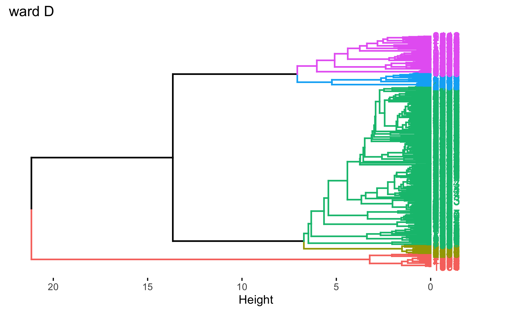
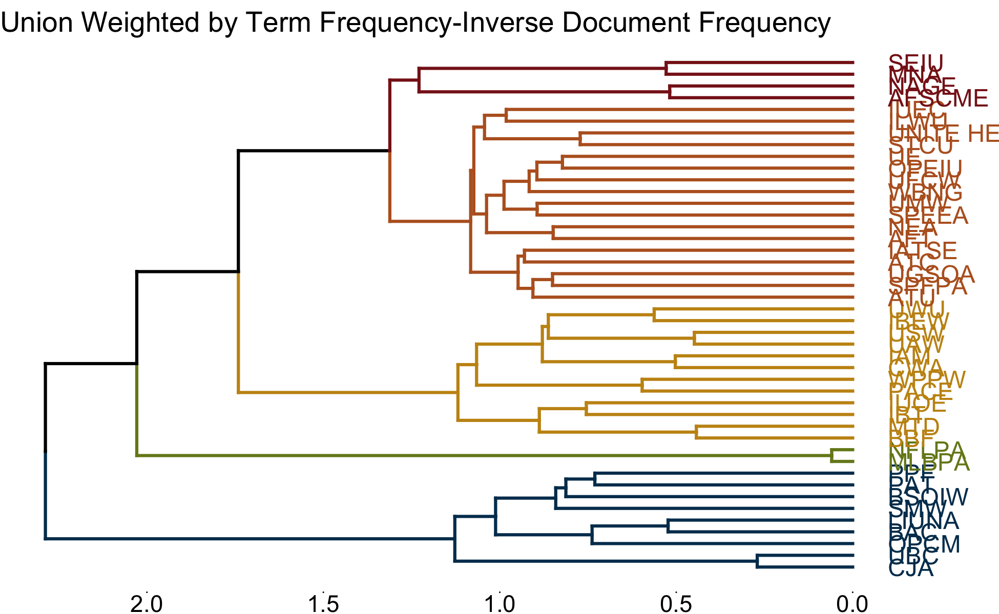
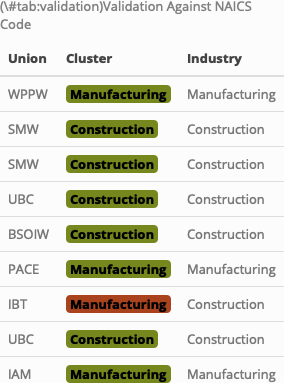

```{r setup, results = 'hide', warning = FALSE, message = FALSE}
knitr::opts_chunk$set(
	echo = TRUE,
	message = FALSE,
	warning = FALSE
)
library(readtext)
library(pdftools)
library(cowplot)
library(lubridate)
library(kableExtra)
library(wordcloud)
library(stringdist)
library(stm)
library(knitr)
library(tidytext)
library(tidyverse)
library(quanteda)
library(quanteda.textmodels)
library(quanteda.textplots)
library(quanteda.textstats)
library(janitor)
library(factoextra)

# Load data
load("/Users/dananestor/DACSS/Blog/Untitled/docs/cba_basic.RData")
clean_union_update <- read_csv("/Users/dananestor/DACSS/Blog/Untitled/docs/clean_union_update.csv")
```


Many thanks to my new partner on this project, Maddi Hertz, without whom
the following would not have been possible. Note that the setup chunk
above contains two new objects that we load in to begin work. Maddi was
able to recreate our data using optical character recognition to create
a corpus that was cleaner and easier to manipulate.

As part of our CBA analysis, we decided to try and use clustering via
contract language to try and discover more about our data and see if
this may be a viable way to control for industry-specific language. The
idea is that, if we can correctly determine which industry a contract
comes from via the language, then that language is likely more
significant to the industry and not the overall landscape of labor
relations. This is where we commence analysis.

<br>

### Cleaning data, corpus creation

Here we take a few additional steps to clean some last bits of data
before creating a corpus.

```{r clean-up}
# Add year variable
cba_corp_df <- cba_corp_df %>%
  mutate(year = year(end_date))

# Join with union labels and fix one misspelling
cba_corp_df <- left_join(cba_corp_df, 
                         clean_union_update, 
                         by = "cba_id")
cba_corp_df <- cba_corp_df %>%
  mutate(union_clean = if_else(union_clean == "LUINA", 
                               "LIUNA", 
                               union_clean))

# Add variable to cba_corp_df that is count of no. CBAs we have from that union
union_counts <- tabyl(cba_corp_df$union_clean)
union_counts <- union_counts %>%
  rename(union_clean = `cba_corp_df$union_clean`)
cba_corp_df <- left_join(cba_corp_df, 
                         union_counts %>% select("union_clean", 
                                                 "n"), 
                         by = "union_clean")
cba_corp_df <- cba_corp_df %>%
  rename(union_count = n)

# Turn it into a corpus object and fix the document names
cba_corpus <- corpus(cba_corp_df)
docnames(cba_corpus) <- cba_corpus$cba_id

# Save metadata as data frame but drop the text so it's much smaller
cba_meta <- tibble(
  convert(cba_corpus, 
          to = "data.frame"))
cba_meta <- cba_meta %>%
  select(-text)

head(cba_meta) %>%
  kable() %>%
  kable_styling(bootstrap_options = c("striped", 
                                      "hover", 
                                      "responsive"))
```

Here we see our data frame without contract text. Note new variables at
the far right.

<br>

### Preprocessing data

Now that we have a corpus and metadata, we can tokenize and start to
clean out symbols, stopwords, etc.

```{r cba-tokenize, cache=TRUE}
# Create tokens object without the junk
cba_tokens <- cba_corpus %>%
  tokens(remove_symbols = T,
         remove_punct = T,
         remove_numbers = T) %>%
  tokens_remove(stopwords("en")) %>%
  tokens_remove(min_nchar = 3) %>%
  tokens_remove(max_nchar = 20) %>%
  tokens_remove(my_stopwords) %>%
  tokens_ngrams(n = 1:2)

# Create sparse dfm
cba_full_dfm <- dfm(cba_tokens)

# Trim dfm so it's not unwieldy 
cba_trim_dfm <- dfm_trim(cba_full_dfm, 
                         min_docfreq = .025, 
                         max_docfreq = .8, 
                         docfreq_type = "prop")
# Check: much better
dim(cba_full_dfm)
dim(cba_trim_dfm)
```

After removing meaningless tokens, we have reduced the size of our
corpus from an unwieldy 3.3M to a much more manageable 49K.

<br>

### Hierarchical Clustering

#### Calculating a Difference Measure

We are now able to take our corpus and start clustering to see how
contract language is related to industry. First, we must calculate a
difference measurement that the clustering algorithm can use.

```{r cba-tfidf}
# Create the weighted dfm
# dfm_tfidf() weights the dfm on the tfidf but the argument scheme_tf = "prop" does it by
# the proportion of the document for each term (essentially row proportions; rows sum to 1) 
cba_trim_tfidf <- dfm_tfidf(cba_trim_dfm, 
                            scheme_tf = "prop")

# Convert to matrix just in case (and easier to inspect)
cba_tfidf_mat <- as.matrix(cba_trim_tfidf)

# Compute the cosine similarity between documents
# and turn it into a matrix that you can actually look at
cba_trim_cos <- textstat_simil(cba_trim_tfidf, 
                               margin = "documents", 
                               method = "cosine")
cba_trim_cos_mat <- as.matrix(cba_trim_cos)
```

After trying a couple of different similarity measurements, we
determined that cosine similarity performed best. What you see above is
the end result of that coding.

Cosine similarity works by assigning text vectors coordinates and
computing the cosine of the angle between the two vectors. Thus the
similarity is not determined by vector magnitude, but rather the angle
between the two with 0 representing perfect orthogonality and 1
representing perfect similarity.

<br>

### Clustering

With our similarity measurement, we can now start clustering. We tried a
few different methods but found hierarchical was best - that code is
below. We also tried several different agglomeration methods and numbers
of clusters (k).

```{r cba-hc, cache=TRUE, results='hide'}
# Now use that matrix for hierarchical clustering utilizing 
# 1 - cosine similarity as our dissimilarity structure; 
# we tried ward.D, ward.D2, and complete for agglomeration method 
# but ward.D was much better overall
cba_cos_hc_comp <- hclust(
  as.dist(1-cba_trim_cos_mat), 
  method = "complete")
cba_cos_hc_wd <- hclust(
  as.dist(1-cba_trim_cos_mat), 
  method = "ward.D")
cba_cos_hc_wd2 <- hclust(
  as.dist(1-cba_trim_cos_mat), 
  method = "ward.D2")

# Best dendograms after playing around with the number of clusters
dend_comp <- fviz_dend(cba_cos_hc_comp, 
                       main = "comp", 
                       k = 4)
dend_wardD <- fviz_dend(cba_cos_hc_wd, 
                        main = "ward D", 
                        k = 5,
                        horiz = TRUE)
dend_wardD2 <- fviz_dend(cba_cos_hc_wd2, 
                         main = "ward D2", 
                         k = 3)

ggsave("dend_wardD.png", 
       plot = dend_wardD)
```

After testing, we found that the ward.D method with k = 5 produced the most reasonable dendogram.



From here, we can clean up and reintegrate our clusters with the data
frame to inspect results.

```{r cba-results}
# Save ward.D with k = 3 because it was the best
cba_cos_wd_k3 <- tibble(cba_id = cba_trim_tfidf$cba_id,
                        cba_clust = cutree(cba_cos_hc_wd, 
                                           k = 3))

# Join results with the data frame version of the corpus
# can now use these later
cba_corp_df <- left_join(cba_corp_df, 
                         cba_cos_wd_k3, 
                         by = "cba_id")

# See which unions were assigned to each cluster
cba_corp_df_sample <- cba_corp_df %>%
  group_by(cba_clust) %>%
  select(cba_clust, 
         year, 
         union_clean) %>%
  slice_sample(n = 5)

cba_corp_df_sample
```

Seems pretty clear that the results are still being overwhelmed by
duplicate contracts. It makes clear clusters of the contracts that we
have many versions of and then lumps everything else together - note
group 3 in this sample table

<br>


### Union Grouping

To get around this problem, we group by union before weighting. We also
remove unions with only one contract because there simply is not enough
data to get reliable results. With more time we would like to try
bootstrapping to try and fill in some missing data, but this will
require many more sample documents going through the OCR step.

For now though, grouping by union will control for an issue where, for
example, 50+ UAW contracts are treated as separate contracts despite
having identical language, thus skewing results. After grouping, these
substantially similar documents will be treated as one observation for
the purposes of our analysis.

We proceed by creating a new corpus, this time via grouped unions.

```{r union-tokens, cache=TRUE}
# Create corpus and filter to keep unions with at least 2 cbas
union_corpus <- cba_corp_df %>%
  filter(union_clean != is.na(union_clean)) %>%
  filter(union_count > 1) %>%
  corpus()

# Fix names
docnames(union_corpus) <- union_corpus$cba_id

# clean tokens
union_tokens <- union_corpus %>%
  tokens(remove_symbols = T,
         remove_punct = T,
         remove_numbers = T) %>%
  tokens_remove(stopwords("en")) %>%
  tokens_remove(min_nchar = 3) %>%
  tokens_remove(max_nchar = 20) %>%
  tokens_remove(my_stopwords) %>%
  tokens_ngrams(n = 1:2)

# Create dfm - still the same as before (minus a few documents) up to this point
union_dfm <- dfm(union_tokens)

# Group by union so now each union is its own document 
# it essentially just adds them all together so the UAW document is actually 
# made of the term frequencies of all approx. 50 UAW cbas
union_dfm <- dfm_group(union_dfm, 
                       groups = union_dfm$union_clean)

# Number of rows has changed
dim(cba_trim_dfm)
dim(union_dfm)
```

We can see that after grouping, we are left with 44 observations rather
than the original 684. While this is not many, it should give better
results because most of the repetitive language is removed.

From here, we remove terms based on document frequency, as before,
weight by TF-IDF, and calculate cosine similarity.

```{r union-tfidf}
# Fewer documents so minimum document frequency has to be a lot bigger
union_trim_dfm <- dfm_trim(union_dfm, 
                           min_docfreq = .2, 
                           max_docfreq = .8, 
                           docfreq_type = "prop")

# From 3,134,166 features to 45,369
# dim(union_dfm)
# dim(union_trim_dfm)

# Weight by proportional tf-idf as before
union_tfidf <- dfm_tfidf(union_trim_dfm, 
                         scheme_tf = "prop")

# Save as matrix
union_tfidf_mat <- as.matrix(union_tfidf)

# Now compute cosine similarity between unions rather than individual cbas
# save that too for good measure
union_cos <- textstat_simil(union_tfidf, 
                            margin = "documents", 
                            method = "cosine")
union_cos_mat <- as.matrix(union_cos)
```

<br>

#### The Final Clustering Model

Based on tinkering above, we have determined that using 1-cosine
similarity is best for our distance measurement. This is calculated
after terms are weighted by TF-IDF to privilege words that are important
in individual documents. This further helps to eliminate very frequently
or infrequently used tokens. We use the ward.D agglomeration method and
5 clusters.

```{r model}
# distance is (1 - cosine similarity) 
# use tfidf weighted dfm - normalized as row proportions; rows sum to 1
# ward.D clustering algorithm with k = 5 clusters

# Cluster with cosine similarity
union_cos_hc_wd <- hclust(as.dist(1 - union_cos_mat), 
                          method = "ward.D")

# Graph with k = 5
union_clust_dend <- fviz_dend(union_cos_hc_wd, 
                              main = "Union Weighted by Term Frequency-Inverse Document Frequency", 
                              k = 5, 
                              k_colors = c("#003b5c", "#76881d", "#c69214", "#b86125", "#881c1c"), 
                              horiz = TRUE, 
                              ggtheme = theme_void())
ggsave("union_cos_hierarchy.png",
       plot = union_clust_dend)
```





This is looking pretty good! Let's take a look at which unions were
added to which cluster.

<br>

#### Cluster Assignments

```{r clusters}
# Save model and join with the data frame corpus
union_cos_wd_k5 <- tibble(union_clean = union_cos_hc_wd$labels,
                          union_clust = cutree(union_cos_hc_wd, 
                                               k = 5))
cba_corp_df <- left_join(cba_corp_df, 
                         union_cos_wd_k5, 
                         by = "union_clean")

# Label clusters based on subject matter knowledge
cba_corp_df <- cba_corp_df %>%
  mutate(union_clust_lab = case_when(union_clust == 1 ~ "Health",
                                     union_clust == 2 ~ "Service",
                                     union_clust == 3 ~ "Construction",
                                     union_clust == 4 ~ "Manufacturing",
                                     union_clust == 5 ~ "Sports"))

# See which unions were assigned to each cluster
cba_corp_df_sample <- cba_corp_df %>%
  group_by(union_clust) %>%
  select(union_clust_lab, 
         year, 
         union_clean) %>%
  slice_sample(n = 10, replace = T) %>%
  kable() %>%
  kable_styling(bootstrap_options = c("striped", 
                                      "hover", 
                                      "responsive"))
```

This table shows us the union and their assigned cluster based on
contract language similarity. Based on subject matter knowledge, it
appears to be accurate. However, we have NAICS industry data for many of
these contracts - we can use this to validate.

<br>

#### Cluster Validation

By pulling in industry information via the NAICS data available through
our metadata, we can verify if our clustering model assigned contracts
correctly.

```{r validation}
# Validate against NAICS info
#add industry info
NAICS_short <- as_tibble( 
                  read_csv("/Users/dananestor/DACSS/Useful Data/NAICS_2_digits.csv", 
                            show_col_types = FALSE)) 
NAICS <- as_tibble(
                  read_csv("/Users/dananestor/DACSS/Useful Data/NAICS_complete.csv", 
                            show_col_types = FALSE))

cba_corp_df$Industry <- NAICS$industry_title[match( #add to df
                            cba_corp_df$naics, 
                            NAICS$industry_code)] %>%
  str_replace_all("NAICS\\s\\d+\\s(.+)", "\\1") %>%
  str_replace_all("NAICS\\d+\\s\\d+\\s(.+)", "\\1")
cba_corp_df <- cba_corp_df %>%
  mutate("Short_Industry" = 
           substr(naics, 1, 2))
cba_corp_df$Short_Industry <- NAICS_short$Definition[match(
                                    cba_corp_df$Short_Industry, 
                                    NAICS_short$Sector)]

#create validation table
cba_cluster_validation <- tibble("Union" = cba_corp_df$union_clean, 
                                 "Cluster" = cba_corp_df$union_clust_lab, 
                                 "Industry" = cba_corp_df$Short_Industry)

#color green if match, red if not
cba_cluster_validation$Cluster <- ifelse(
  cba_cluster_validation$Cluster == cba_cluster_validation$Industry,
  cell_spec(cba_cluster_validation$Cluster, 
            color = "black", 
            background = "#76881d", bold = T),
  cell_spec(cba_cluster_validation$Cluster, 
            color = "black", 
            background = "#a8431e", bold = T))

#format and save
cba_cluster_validation <- cba_cluster_validation %>%
  filter(
    !is.na(cba_cluster_validation$Cluster)) %>%
  slice_head(n = 9) %>%
kbl(caption = "Validation Against NAICS Code", 
    escape = FALSE) %>% 
  kable_styling(full_width = FALSE)

save_kable(cba_cluster_validation, 
           file = "cba_cluster_validation.png")

# Write out the data frame corpus to use in the next post (topic models)
write_csv(cba_corp_df, "cba_clust_df.csv")

```



Here we see a table showing assigned cluster vs. known industry. Matches
are colored green and misses are red.

At this point, we are pleased and a bit surprised at how well this
worked. It shows that industry-specific language is very important in
clustering contracts, which suggests that finding a way to control for
this language will be important when we move to topic modelling.

In our next post we do just that - refine industry language via
groupings and create a topic model.
